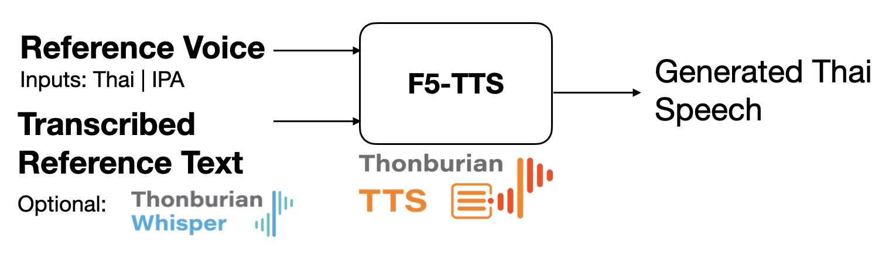

<p align="center">
  <br>
  
  
</p>

[🔊 Model Checkpoints](https://huggingface.co/biodatlab/ThonburianTTS) | [🤗 Gradio Demo](https://github.com/biodatlab/thonburian-tts/blob/main/gradio_app.py) | [📄 Thonburian TTS Paper]()

## **Thonburian TTS**

**Thonburian TTS** is a **Thai Text-to-Speech (TTS)** engine built on top of the [F5-TTS](https://github.com/SWivid/F5-TTS).  
It generates **natural and expressive Thai speech** by leveraging **Flow-Matching diffusion techniques** and can **mimic reference voices** from short audio samples. The system supports:

- **Thai language generation** (`language="th"`)
- **Reference-based voice cloning** using short audio clips
- High-quality synthesis with controllable speed and silence trimming

### **Pipeline Overview**



This workflow enables:
- **High-quality Thai speech generation** from text
- Voice cloning with **style and tone preservation**
- ASR-TTS integration for interactive voice applications


## **Quick Usage**

Below is a minimal example for generating **Thai speech** with **voice cloning** using a reference sample.

```py
from flowtts.inference import FlowTTSPipeline, ModelConfig, AudioConfig
import torch

# Configure F5-TTS model
model_config = ModelConfig(
    language="th",
    model_type="F5",
    checkpoint="hf://biodatlab/ThonburianTTS/megaF5/mega_f5_last.safetensors",
    vocab_file="hf://biodatlab/ThonburianTTS/megaF5/mega_vocab.txt",
    vocoder="vocos",
    device="cuda" if torch.cuda.is_available() else "cpu"
)

# Basic audio settings
audio_config = AudioConfig(
    silence_threshold=-45,
    cfg_strength=2.5,
    speed=1.0
)

pipeline = FlowTTSPipeline(model_config, audio_config)

# Input text and reference voice
text = "ยินดีที่ได้รู้จักคุณวันนี้อากาศดีมาก"
ref_voice = "ref_samples/ref_sample.wav"
ref_text = "ยินดีที่ได้รู้จัก"  # Manual transcript of the reference clip

# Generate speech
output_path = pipeline(
    text=text,
    ref_voice=ref_voice,
    ref_text=ref_text,
    output_file="f5_output.wav"
)
print(f"Generated F5 audio saved to: {output_path}")
```


## **Installation**

Install dependencies:

```bash
pip install torch cached-path librosa transformers f5-tts
sudo apt install ffmpeg
```

## **Model Checkpoints**

| Model Component        | Description                        | URL                                                                          |
| ---------------------- | ---------------------------------- | ---------------------------------------------------------------------------- |
| **F5-TTS Thai**        | Flow Matching-based Thai TTS models | [Link](https://huggingface.co/biodatlab/ThonburianTTS/tree/main/megaF5)               |
| **F5-TTS IPA**         | Flow Matching-based Thai-IPA TTS models | [Link](https://huggingface.co/biodatlab/ThonburianTTS/tree/main/megaIPA)            |


## **Example Outputs**

<table>
  <tr>
    <td align="center">
      <a href="https://youtu.be/rvmNgh0-jws">
        <br>
        🎵 Sample 1 – Single-speaker Thai Normal Text
      </a>
    </td>
    <td align="center">
      <a href="https://youtu.be/jVz3EpRTn1U">
        <br>
        🎵 Sample 2 – Single-Speaker Thai Code-mixed Text
      </a>
    </td>
    <td align="center">
      <a href="https://youtu.be/sbaOdMhz3Z4">
        <br>
        🎵 Sample 3 – Multi-Speaker Conversational Speech
      </a>
    </td>
  </tr>
</table>

---

## **Developers**

- [Looloo Technology](https://loolootech.com/)
- [WordSense](https://www.facebook.com/WordsenseAI) by [Looloo technology](https://loolootech.com/)
- [Biomedical and Data Lab, Mahidol University](https://biodatlab.github.io/)

<p align="center">
  
  
</p>


## **Citation**

If you use **ThonburianTTS** in your research, please cite:

> Thura Aung, Panyut Sriwirote, Thanachot Thavornmongkol, Knot Pipatsrisawat, Titipat Achakulvisut, Zaw Htet Aung, "ThonburianTTS: Enhancing Neural Flow Matching Models for Authentic Thai Text-to-Speech", 2025 20th International Joint Symposium on Artificial Intelligence and Natural Language Processing (iSAI-NLP), Phuket, Thailand, 2025, pp. 1-6


## **License**

Our **codes** are released under the [MIT License](LICENSE-MIT).
The **models** are released under the [Creative Commons Attribution Non-Commercial ShareAlike 4.0 License (CC BY-NC-SA 4.0)](LICENSE-CC-BY-NC-SA).
